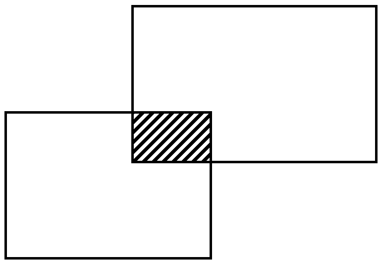

Shield: [![CC BY-SA 4.0][cc-by-sa-shield]][cc-by-sa]

This work is licensed under a
[Creative Commons Attribution-ShareAlike 4.0 International License][cc-by-sa].

[![CC BY-SA 4.0][cc-by-sa-image]][cc-by-sa]

[cc-by-sa]: http://creativecommons.org/licenses/by-sa/4.0/
[cc-by-sa-image]: https://licensebuttons.net/l/by-sa/4.0/88x31.png
[cc-by-sa-shield]: https://img.shields.io/badge/License-CC%20BY--SA%204.0-lightgrey.svg

## A WebAPI .NET test project

    

This project was developed as  a test task. But I found that it might be a good 
template for somebody's WebAPI application.

⚠️ **In case of any questions** – do not hesitate to contact the author in Telegram group ([see below](#contact-me)) and ask.

## Description
A simple WebAPI application for searching all intersected rectangles from DB. There is also a WEB method to initialize the DB wit randomly generated rectangles. All the Business Logic is covered with tests.

**Stack of technologies:** EF Core, .NET 8.0, sqlite, C#, MSTest

List of projects:
 - **Common** - common DTOs and interfaces;
 - **DAL**(Data Access Level) - EF context, entities and low level SQL logic(might be in the future);
 - **Logic** - Business Logic;
 - **Logic.Tests** - set of Integration test with Business Logic. In-memory sqlite DB is used for testing there;
 - **Web** - WebAPI application itself.

## Contact me
  - Telegram: [https://t.me/YarickWorkshop](https://t.me/YarickWorkshop/316)
  - YouTube: https://www.youtube.com/@yarick-workshop

Yeah, they both are in Russian.

**If you have any questions** – contact me in either Telegram channel (see above) or Mail: techno.man.983@gmail.com. I can communicate in English without any problems. 

⚠️ **Pay attention**: I do not answer to any comments on YouTube (despite I read them). Why? It is a HUGE secret 🙃
